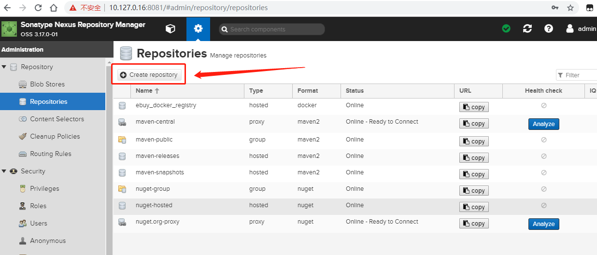
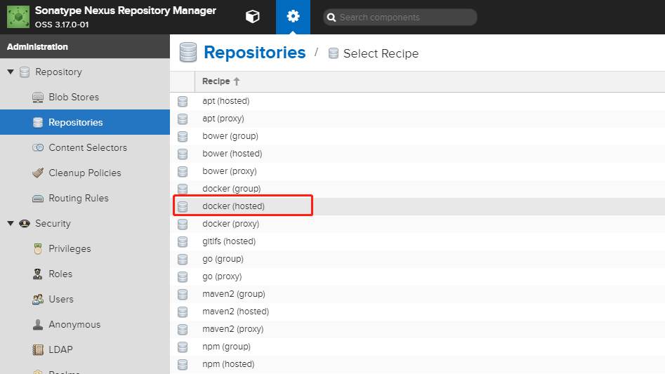
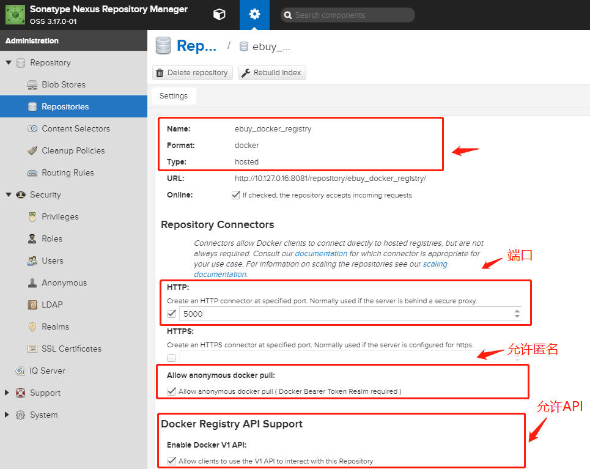
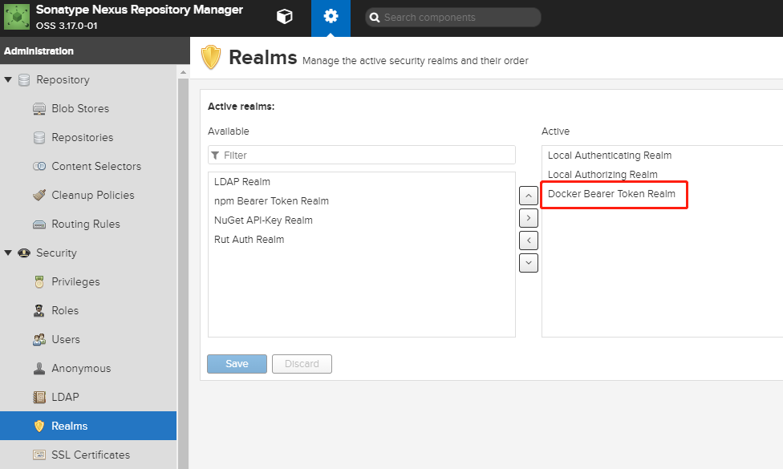
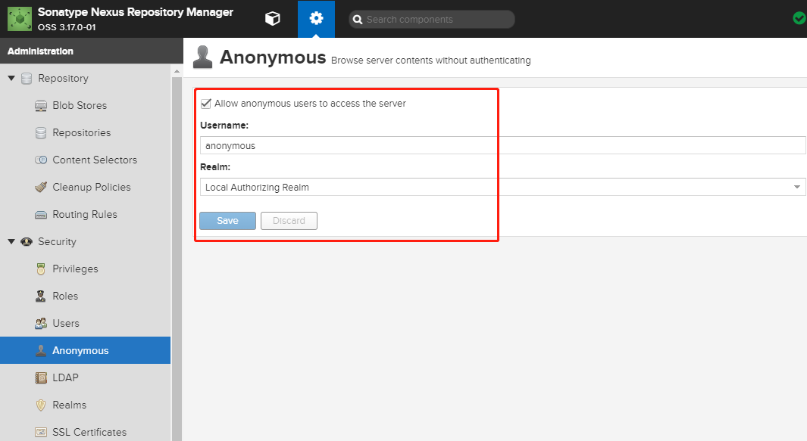
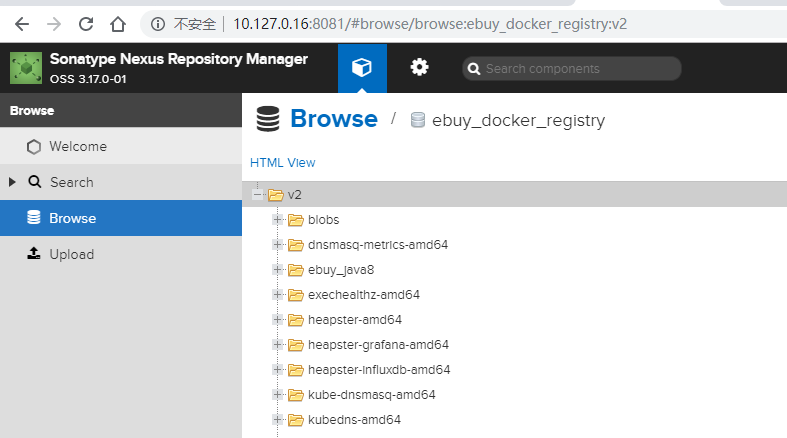
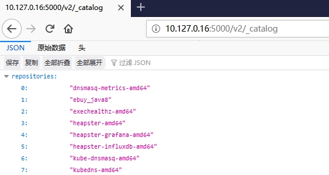

::: tip
Nexus3是Sonatype提供的仓库管理平台，Nuexus Repository OSS3能够支持Maven、npm、Docker、YUM、Helm等格式数据的存储和发布
:::

<!-- more -->

## 安装nexus

前文已写过如何在[CentOS上搭建私有maven仓库](/system/2015-11-12-centos-install-maven.html#安装nexus-3.3.1-01)

本文将创建一个提供`docker hub`(**docker register**)功能的`nexus`私有仓库

## 创建docker镜像仓库

通过管理员帐户登录nexus，并进入创建为docker的镜像仓库的主页：





在创建镜像仓库的页面中，设置镜像仓库的相关信息，包括名称、HTTP端口、是否允许匿名拉取镜像等信息。

这里需要注意的是，此处的HTTP端口(此处的值为5000)很重要，后续拉取和推送进行是使用此端口进行的，而不是nexus本身对外暴露的端口。另外，如果允许设置通过匿名的方式拉取镜像。

这需要在Realms主页激活Docker Bearer Token Reamlm，如下图所示：



并对匿名方式进行设置，允许通过匿名方式访问服务器，如下图进行设置：



## docker客户端设置

在完成私有镜像仓库的设置后，由于使用的是HTTP协议，因此需要在客户端对docker进行配置。

在客户端的`/etc/docker/daemon.json`文件中添加下面的内容：


```bash
# vim /etc/docker/daemon.json
//在文件中添加如下的内容，告诉客户端私有镜像仓库是一个安全的仓库：
{"insecure-registries":["10.127.0.16:5000"]}
# systemctl daemon-reload
# systemctl restart docker
```

## 登录认证

在通过nexus完成私有镜像仓库的构建后，首先需要进行登录认证才能进行后续的操作，私有镜像仓库登录认证的语法和格式：`docker login` `<nexus-hostname>:<repository-port>`。

上述的nexus部署在IP地址为`10.127.0.16`主机上，私有镜像的端口为`5000`，则通过执行如下的命令登录私有镜像仓库：

```bash
docker login 10.127.0.16:5000
```

登录时，需要提供用户名和密码。认证的信息会被保存在`~/.docker/config.json`文件，在后续与私有镜像仓库交互时就可以被重用，而不需要每次都进行登录认证。

## 拉取上传镜像

```bash
# 国外机器拉取被河蟹的镜像并保存传到国内 #
docker pull myhub.fdccloud.com/library/kubedns-amd64:1.9
docker pull myhub.fdccloud.com/library/kube-dnsmasq-amd64:1.4
docker pull myhub.fdccloud.com/library/dnsmasq-metrics-amd64:1.0
docker pull myhub.fdccloud.com/library/exechealthz-amd64:1.2

docker save myhub.fdccloud.com/library/kubedns-amd64:1.9  > kubedns-amd64.tar
docker save myhub.fdccloud.com/library/kube-dnsmasq-amd64:1.4  > kube-dnsmasq-amd64.tar
docker save myhub.fdccloud.com/library/dnsmasq-metrics-amd64:1.0  > dnsmasq-metrics-amd64.tar
docker save myhub.fdccloud.com/library/exechealthz-amd64:1.2  > exechealthz-amd64.tar

# node-1导入镜像 #
docker load < kubedns-amd64.tar
docker load < kube-dnsmasq-amd64.tar
docker load < dnsmasq-metrics-amd64.tar
docker load < exechealthz-amd64.tar

# node-1 镜像打tag并传至私服 #
docker tag myhub.fdccloud.com/library/kubedns-amd64:1.9 registry:5000/kubedns-amd64:1.9
docker push registry:5000/kubedns-amd64:1.9

docker tag myhub.fdccloud.com/library/kube-dnsmasq-amd64:1.4 registry:5000/kube-dnsmasq-amd64:1.4
docker push registry:5000/kube-dnsmasq-amd64:1.4

docker tag myhub.fdccloud.com/library/dnsmasq-metrics-amd64:1.0 registry:5000/dnsmasq-metrics-amd64:1.0
docker push registry:5000/dnsmasq-metrics-amd64:1.0

docker tag myhub.fdccloud.com/library/exechealthz-amd64:1.2 registry:5000/exechealthz-amd64:1.2
docker push registry:5000/exechealthz-amd64:1.2
```

## 访问nexus后台repository查看镜像

http://10.127.0.16:8081/#browse/browse:ebuy_docker_registry:v2



## 访问API查看镜像

http://10.127.0.16:5000/v2/_catalog




参考
https://blog.51cto.com/daibaiyang119/2147894


docker

```bash
docker run -d -p 8081:8081 --name nexus sonatype/nexus3
```

K8S

```bash
apiVersion: apps/v1
kind: Deployment
metadata:
  name: nexus3
  namespace: default
spec:
  replicas: 1
  selector:
    matchLabels:
      app: nexus3
  template:
    metadata:
      labels:
        app: nexus3
    spec:
      nodeSelector:
        kubernetes.io/hostname: k8s-node-1
      containers:
      - name: nexus3
        image: sonatype/nexus3:3.25.0
        imagePullPolicy: IfNotPresent

        ports:
          - name: docker-registry
            containerPort: 5000
            hostPort: 5000
          - name: management
            containerPort: 8081
            hostPort: 8081

        volumeMounts:
        - mountPath: /opt/sonatype/sonatype-work
          name: nexus3-storage
      volumes:
      - name: nexus3-storage
        hostPath:
          path: /dbdata/nexus3
```
