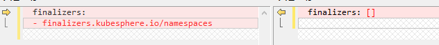

**问题背景**

部署``KubeSphere``中间有问题，删除集群重新部署的，导致命名空间状态一直处于``Terminating``，使用`kubectl get all -n $NAMESPACE`命令显示已经没有资源，但仍无法删除。

命名空间无法删除通常是因为还有资源在使用这个命名空间，这个资源可能自己的状态也已经不正常了，或者是因为不正确的操作导致有空耦合

```bash
[root@k8s-master ~]# kubectl  get ns
NAME                           STATUS        AGE
istio-system                   Active        21h
paas-app                       Active        44d
kube-system                    Active        44d
kubesphere-controls-system     Terminating   21h
kubesphere-devops-system       Terminating   21h
kubesphere-logging-system      Terminating   21h
kubesphere-monitoring-system   Terminating   23h
kubesphere-system              Terminating   23h
openpitrix-system              Terminating   21h
```

三种尝试方法，最后一个终于成功删除了，此处记录一下

**1. 强制删除**

```bash
kubectl delete namespace kubesphere-system --force --grace-period=0
```


**2. 使用api删除**

```bash
#先安装jq
wget http://dl.fedoraproject.org/pub/epel/epel-release-latest-7.noarch.rpm
rpm -ivh epel-release-latest-7.noarch.rpm
yum install -y jq
```

```bash
NAMESPACE=kubesphere-system
kubectl proxy &
kubectl get namespace $NAMESPACE -o json |jq '.spec = {"finalizers":[]}' >temp.json
curl -k -H "Content-Type: application/json" -X PUT --data-binary @temp.json 127.0.0.1:8001/api/v1/namespaces/$NAMESPACE/finalize
```

**3. ``kubectl edit``修改状态**

``kubectl edit namespace kubesphere-system``

将``finalizers``这条``value``改为``finalizers: []``



保存即可看到该``namespace``已被删除

也可以使用

`kubectl patch ns kubesphere-system -p '{"metadata":{"finalizers":null}}'`


参考

https://blog.csdn.net/fengwuxichen/article/details/87877214

https://segmentfault.com/a/1190000016924414
