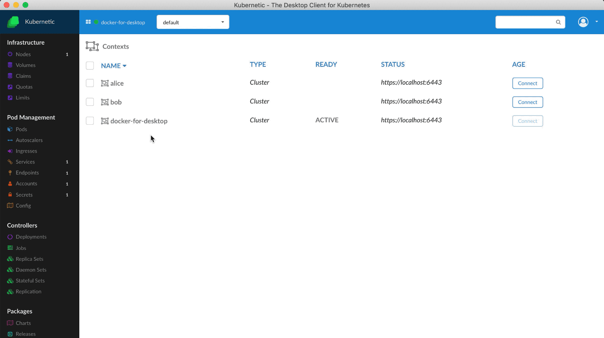

:::tip
如果有多个不同的集群，需要切换访问，就需要配置多个`Kubernetes`账号和`Context`；集群的`KubeConfig`文件一般为`~/.kube/config`，默认只能访问一个集群，如果需要访问多个集群就需要修改这个文件

可以参考文档`https://kubernetes.io/zh/docs/tasks/access-application-cluster/configure-access-multiple-clusters/`配置
:::

<!-- more -->


现在有两个集群，一个是本地的`dev`，另一个是部署在测试环境的`test`，本地只有`dev`的配置

根据官方文档合并后的`Demo`，其实是将两个`Config`文件的相同类型的字段直接合并了，所以直接将相同的字段的其他集群的配置内容复制到当前的配置中即可

以下为合并后的配置

```yml
apiVersion: v1
clusters:
  - cluster:
      server: 'http://192.168.0.11:8080'
    name: test
  - cluster:
      server: 'http://10.10.3.123:8080'
    name: dev
contexts:
  - context:
      cluster: test
      namespace: default
      user: ''
    name: test
  - context:
      cluster: dev
      namespace: default
      user: ''
    name: dev
current-context: test
kind: Config
preferences: {}
users: []
```

更新配置

```bash
export KUBECONFIG=~/.kube/config
```

查看合并后的 kubeconfig

```bash
kubectl config view
```

查看集群

```bash
kubectl config get-contexts
```

切换集群

```bash
kubectl config use-context test
kubectl config use-context dev
```

通过[kubernetic][1]管理集群



参考

https://blog.csdn.net/u013360850/article/details/83315188


  [1]: https://kubernetic.com/

