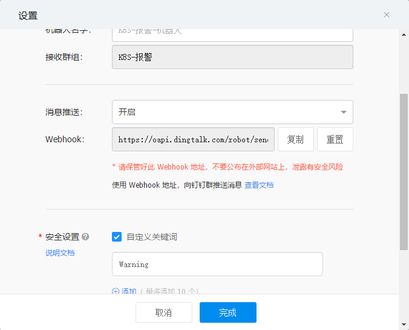
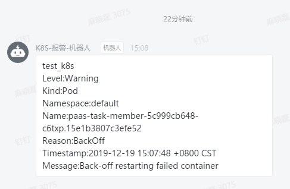

项目文档

↓↓↓↓

https://github.com/AliyunContainerService/kube-eventer/blob/master/docs/en/dingtalk-sink.md

钉钉建群，并添加钉钉告警机器人，**注意保存webhook，设置关键字为Warning**

↓↓↓↓




告警效果

↓↓↓↓




yaml文件，只需要**修改标黑部分**

↓↓↓↓

```bash {30}
[root@k8s-master system]# cat kube-eventer.yaml 
apiVersion: apps/v1beta2
kind: Deployment
metadata:
  labels:
    name: kube-eventer
  name: kube-eventer
  namespace: kube-system
spec:
  replicas: 1
  selector:
    matchLabels:
      app: kube-eventer
  template:
    metadata:
      labels:
        app: kube-eventer
      annotations:
        scheduler.alpha.kubernetes.io/critical-pod: ''
    spec:
      dnsPolicy: ClusterFirstWithHostNet
      serviceAccount: kube-eventer
      containers:
        - image: registry.aliyuncs.com/acs/kube-eventer-amd64:v1.1.0-63e7f98-aliyun
          name: kube-eventer
          command:
            - "/kube-eventer"
            - "--source=kubernetes:https://kubernetes.default"
            ## .e.g,dingtalk sink demo
            - --sink=dingtalk:https://oapi.dingtalk.com/robot/send?access_token=cbffa8baf&label=test_k8s&level=Warning&namespaces=default
          env:
          # If TZ is assigned, set the TZ value as the time zone
          - name: TZ
            value: Asia/Shanghai
          volumeMounts:
            - name: localtime
              mountPath: /etc/localtime
              readOnly: true
            - name: zoneinfo
              mountPath: /usr/share/zoneinfo
              readOnly: true
          resources:
            requests:
              cpu: 100m
              memory: 100Mi
            limits:
              cpu: 500m
              memory: 250Mi
      volumes:
        - name: localtime
          hostPath:
            path: /etc/localtime
        - name: zoneinfo
          hostPath:
            path: /usr/share/zoneinfo
---
apiVersion: rbac.authorization.k8s.io/v1
kind: ClusterRole
metadata:
  name: kube-eventer
rules:
  - apiGroups:
      - ""
    resources:
      - events
    verbs:
      - get
      - list
      - watch
---
apiVersion: rbac.authorization.k8s.io/v1
kind: ClusterRoleBinding
metadata:
  annotations:
  name: kube-eventer
roleRef:
  apiGroup: rbac.authorization.k8s.io
  kind: ClusterRole
  name: kube-eventer
subjects:
  - kind: ServiceAccount
    name: kube-eventer
    namespace: kube-system
---
apiVersion: v1
kind: ServiceAccount
metadata:
  name: kube-eventer
  namespace: kube-system

[root@k8s-master system]# 
```
