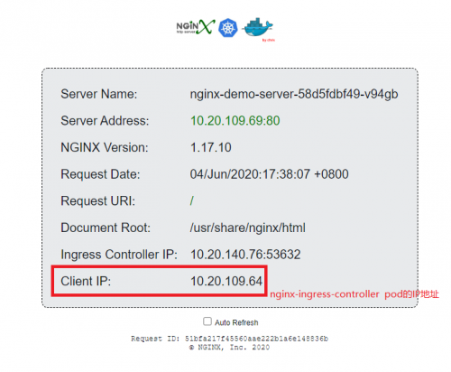
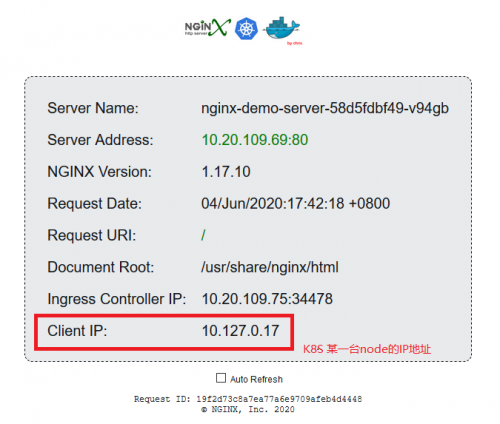
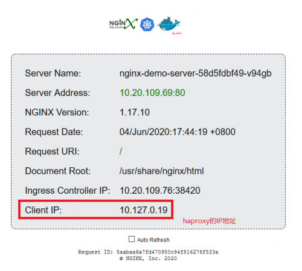
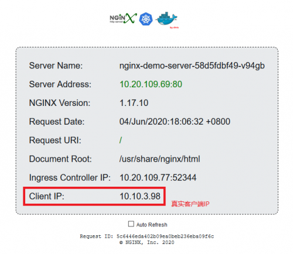

::: tip
架构为

pod <== nginx-ingress <== haproxy <== Internet
:::

<!-- more -->

操作方式

kubectl edit cm nginx-configuration -n ingress-nginx

也可以修改nginx-ingress.yaml

以下为配置方法


默认情况下



或者



增加标记参数 重新apply nginx-ingress.yaml

```bash {11}
apiVersion: v1
kind: Service
metadata:
  name: ingress-nginx
  namespace: ingress-nginx
  labels:
    app.kubernetes.io/name: ingress-nginx
    app.kubernetes.io/part-of: ingress-nginx
spec:
  type: NodePort
  externalTrafficPolicy: Local
```


可见获取了客户端真实IP，但是是前端的代理haproxy的IP地址。。。


继续增加标记参数 重新apply nginx-ingress.yaml

```bash {11,12,13,14,15,16,17,18}
kind: ConfigMap
apiVersion: v1
metadata:
  name: nginx-configuration
  namespace: ingress-nginx
  labels:
    app.kubernetes.io/name: ingress-nginx
    app.kubernetes.io/part-of: ingress-nginx
data:

  # 获取真实IP地址
  compute-full-forwarded-for: "true"
  forwarded-for-header: "X-Forwarded-For"
  use-forwarded-headers: "true"

  # nginx-ingress前端还有代理,后端获取真实IP
  # proxy-real-ip-cidr: 10.127.0.10
  use-proxy-protocol: "true"
```

前置haproxy配置 须增加send-proxy参数

```bash
listen nginx_gress_http
     mode http
     balance roundrobin
     bind 0.0.0.0:80
     timeout client 30s
     timeout server 30s
     timeout connect 30s
     server k8s_node_1 10.127.0.17:32080 weight 1 check inter 2000 rise 5 fall 10 send-proxy
     server k8s_node_2 10.127.0.18:32080 weight 1 check inter 2000 rise 5 fall 10 send-proxy


listen nginx_gress_https
     mode tcp
     balance roundrobin
     bind 0.0.0.0:443
     timeout client 30s
     timeout server 30s
     timeout connect 30s
     server k8s_node_1 10.127.0.17:32443 weight 1 check inter 2000 rise 5 fall 10 send-proxy
     server k8s_node_2 10.127.0.18:32443 weight 1 check inter 2000 rise 5 fall 10 send-proxy
```




收工！！！


如果前端代理为nginx, 需注意加到nginx.conf主配http外部


```bash {12}
stream {
    upstream name {
        server 10.127.0.17:32443 max_fails=3 fail_timeout=30s;
        server 10.127.0.18:32443 max_fails=3 fail_timeout=30s;
    }

    server {
        listen 443  ;
            proxy_connect_timeout 1s;
            proxy_timeout 3s;
            proxy_pass name;
            proxy_protocol on;
    }
```


实现原理不再赘述，网上一大推

参考文档如下:

https://kubernetes.github.io/ingress-nginx/user-guide/nginx-configuration/configmap/#use-proxy-protocol

https://chanjarster.github.io/chanjarster.github.io/post/k8s/pass-client-ip-to-backend/

https://blog.csdn.net/weixin_30817749/article/details/99336992
