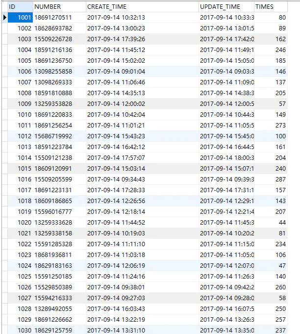

```sql
-- 取7到12的随机整数，包括7到12
SELECT FLOOR(7 + (RAND() * 6))  

-- 取12到24的随机整数，包括12到24
SELECT FLOOR(12+(rand()*13))  

-- 取0-24之间的随机数，不够2位的前补0
SELECT LPAD(FLOOR(0 + (RAND() * 23)),2,0)  


-- 需求如下：
-- 改成的时间格式为 ： 2015-11-25 07:43:11
-- 赋一个随机创建日期，年份为2015-2015

select concat( CONCAT(FLOOR(2015 + (RAND() * 1)),'-',LPAD(FLOOR(10 + (RAND() * 2)),2,0),'-',LPAD(FLOOR(1 + (RAND() * 25)),2,0)))
-- 结果：2015-11-15

select CONCAT(LPAD(FLOOR(0 + (RAND() * 23)),2,0),':',LPAD(FLOOR(0 + (RAND() * 59)),2,0),':',LPAD(FLOOR(0 + (RAND() * 59)),2,0))
-- 结果：20:57:10

-- 拼好之后，再写update语句就可以了
update 'review' set 'created_at'= concat( CONCAT(FLOOR(2015 + (RAND() * 1)),'-',LPAD(FLOOR(10 + (RAND() * 2)),2,0),'-',LPAD(FLOOR(1 + (RAND() * 25)),2,0)),' ',CONCAT(LPAD(FLOOR(0 + (RAND() * 23)),2,0),':',LPAD(FLOOR(0 + (RAND() * 59)),2,0),':',LPAD(FLOOR(0 + (RAND() * 59)),2,0)))  WHERE 1
```


**1. 需求**

>* 将DATE_TEST的1140条数据的CREATE_TIME设置为2017年9月14日工作时间(早9点到晚6点)范围内随机时间

>* 在此基础上将UPDATE_TIME设置为CREATE_TIME之后的40~300秒之间的随机时间

>* 计算出UPDATE_TIME和CREATE_TIME之差，单位秒

**2. 将DATE_TEST的1140条数据的CREATE_TIME设置为2017年9月14日工作时间(早9点到晚6点)范围内随机时间**

```sql
SELECT CONCAT('2017-09-14 ', LPAD(FLOOR(9 + (RAND() * 9)),2,0),':',LPAD(FLOOR(0 + (RAND() * 59)),2,0),':',LPAD(FLOOR(0 + (RAND() * 59)),2,0));

UPDATE DATE_TEST SET CREATE_TIME = CONCAT('2017-09-14 ', LPAD(FLOOR(9 + (RAND() * 9)),2,0),':',LPAD(FLOOR(0 + (RAND() * 59)),2,0),':',LPAD(FLOOR(0 + (RAND() * 59)),2,0));
```

FLOOR 舍去小数部分，只返回正数部分。 ROUND小数部分四舍五入，然后返回正数部分。

LPAD：返回字符串str，左填充用字符串padstr填补到len字符长度。

如果str为大于len长，返回值被缩短至len个字符(即，不能超过 len 长)。 RPAD相反，是右填充字符串。

**3. 将UPDATE_TIME设置为CREATE_TIME之后的40~300秒之间的随机时间**

```sql
SELECT DATE_ADD('2017-09-14 12:12:33',INTERVAL LPAD(FLOOR(40 + (RAND() * 260)),3,0) second);

UPDATE DATE_TEST SET UPDATE_TIME = DATE_ADD(CREATE_TIME,INTERVAL LPAD(FLOOR(40 + (RAND() * 260)),3,0) second);
```

**4. 计算出UPDATE_TIME和CREATE_TIME之差，单位秒**

```sql
SELECT TIMESTAMPDIFF(second, '2010-04-23 17:53:38', '2010-04-23 17:53:39');

UPDATE DATE_TEST SET TIMES = TIMESTAMPDIFF(second, CREATE_TIME, UPDATE_TIME);
```

**5. 最终整理好的数据**


