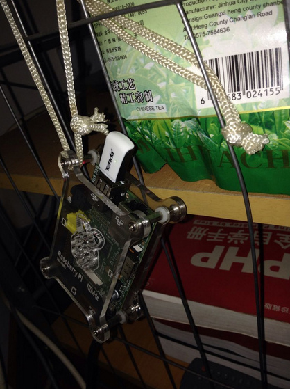

:::tip 
由于不想老是拖着网线，就想给小派加一个无线网卡
:::

<!-- more -->


由于不想老是拖着网线，就想给小派加一个无线网卡

首先查看树莓派外设兼容列表：[http://elinux.org/RPi\_VerifiedPeripherals#USB\_Wi-Fi_Adapters](http://elinux.org/RPi_VerifiedPeripherals#USB_Wi-Fi_Adapters)

以确定自己的无线网卡是否可用，一般免驱的大多可用。这种USB无线网卡，一般只要二三十块钱就可以搞定。

我是在京东购买的 **腾达（TENDA）W311M 150M mini无线网卡**，[购买链接](http://item.jd.com/297759.html)

**安装无线网卡的时候并必须先关闭树莓派然后在插上无线网卡，最后开机，由于直接热插的时候会产生不稳定的电流有可能会损坏小派的板子**

### 1、安装好无线网卡开机之后查看自己的无线网卡是否生效

sudo lsusb查看已挂载的USB设备

```bash
pi@raspberrypi ~ $ sudo lsusb
Bus 001 Device 001: ID 1d6b:0002 Linux Foundation 2.0 root hub
Bus 001 Device 002: ID 0424:9512 Standard Microsystems Corp. 
Bus 001 Device 003: ID 0424:ec00 Standard Microsystems Corp. 
Bus 001 Device 004: ID 148f:5370 Ralink Technology, Corp. RT5370 Wireless Adapter
```

最后一行标有 **802.11n WLAN Adapter** 即是我的无线网卡，表明设备可用。

ifconfig查看网卡可以看到wlan0

### 2、测试wifi信号

```bash
pi@raspberrypi ~ $ sudo iwlist wlan0 scan
```

找到自己无线路由器的ssid

### 3、编辑网卡配置信息

设置网卡配置

```bash
pi@raspberrypi ~ $ sudo cat /etc/network/interfaces

auto lo
iface lo inet loopback

#eth0有线 由于在下的小派经常更换网络环境，所以设置DHCP，省的在接显示器
auto eth0
iface eth0 inet dhcp

#wlan0 设置DHCP
auto wlan0
allow-hotplug wlan0
iface wlan0 inet manual
wpa-roam /etc/wpa_supplicant/wpa_supplicant.conf  ##wifi-config配置文件
iface default inet dhcp
```

设置wifi-config配置文件wpa_supplicant.conf

```bash
pi@raspberrypi ~ $ sudo cat /etc/wpa_supplicant/wpa_supplicant.conf
ctrl_interface=DIR=/var/run/wpa_supplicant GROUP=netdev
update_config=1

network={
ssid="TPlink"  ##无线SSID号
proto=RSN
key_mgmt=WPA-PSK
pairwise=CCMP TKIP
group=CCMP TKIP
psk="123456"  ##无线密码
}
```
    

### 4、重启树莓派

```bash
pi@raspberrypi ~ $ sudo reboot
```

### 5、查看wlan连接状态

```bash
pi@raspberrypi ~ $ ifconfig
eth0      Link encap:Ethernet  HWaddr 11:11:11:11:11:11 
          inet addr:192.168.111.118  Bcast:192.168.111.255  Mask:255.255.255.0
          UP BROADCAST RUNNING MULTICAST  MTU:1500  Metric:1
          RX packets:9586 errors:0 dropped:0 overruns:0 frame:0
              TX packets:10038 errors:0 dropped:0 overruns:0 carrier:0
          collisions:0 txqueuelen:1000 
          RX bytes:1111968 (1.0 MiB)  TX bytes:3134959 (2.9 MiB)

lo        Link encap:Local Loopback  
          inet addr:127.0.0.1  Mask:255.0.0.0
          UP LOOPBACK RUNNING  MTU:16436  Metric:1
          RX packets:11574 errors:0 dropped:0 overruns:0 frame:0
          TX packets:11574 errors:0 dropped:0 overruns:0 carrier:0
          collisions:0 txqueuelen:0 
          RX bytes:63152698 (60.2 MiB)  TX bytes:63152698 (60.2 MiB)

wlan0     Link encap:Ethernet  HWaddr 11:11:11:11:11:12
          inet addr:192.168.111.119  Bcast:192.168.111.255  Mask:255.255.255.0
          UP BROADCAST RUNNING MULTICAST  MTU:1500  Metric:1
          RX packets:1632 errors:0 dropped:0 overruns:0 frame:0
          TX packets:720 errors:0 dropped:0 overruns:0 carrier:0
          collisions:0 txqueuelen:1000 
          RX bytes:158997 (155.2 KiB)  TX bytes:75676 (73.9 KiB)
```

这样子就可以拔掉网线使用无线啦！下一步打算把Raspberry Pi 配置成无线路由器！
--------------------------------------------

最后放图给大家看看最新改造的小派
----------------


