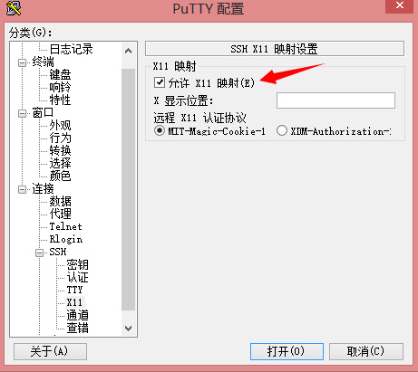
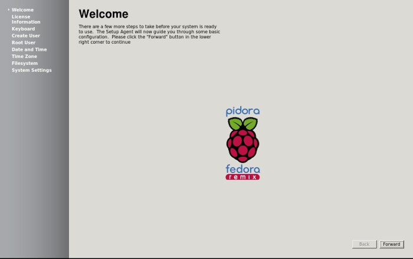
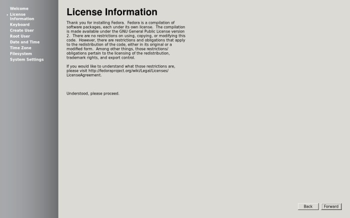
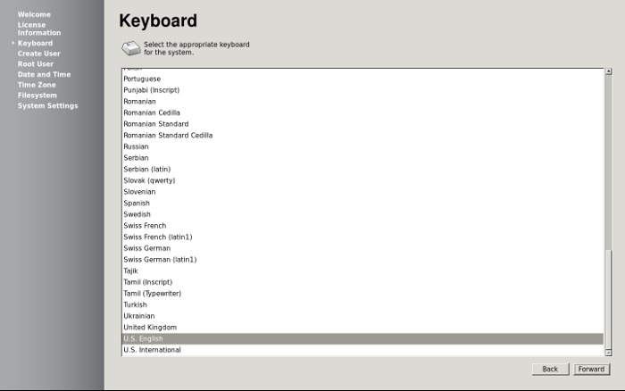
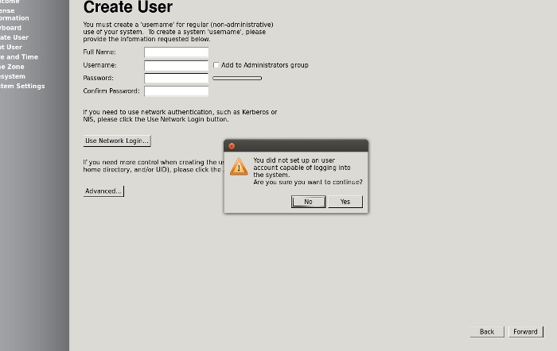
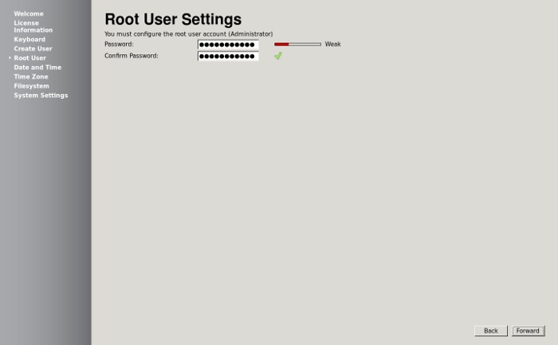
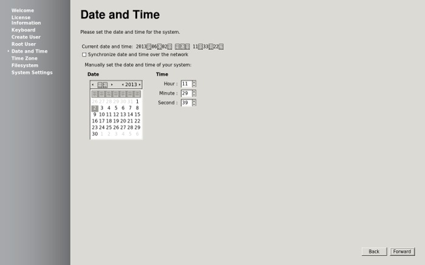
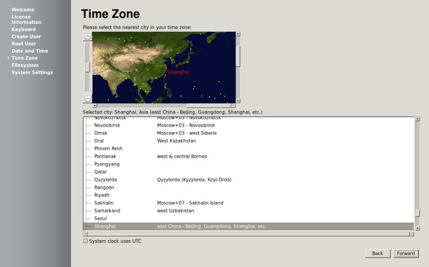
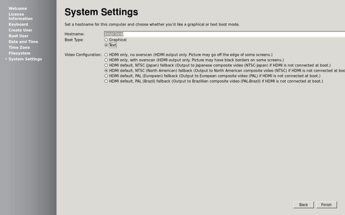
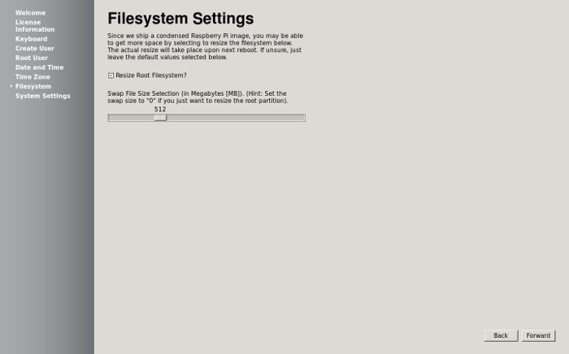

# Pidora 2014 试用
==============

### Pidora 2014 发布，此版本是基于 ARMv6 架构的 Fedora，包括了 Fedora 20 的包集合。值得关注的特性如下：

  

**rootfs-resize now works with logical partitions**

**Raspberry Pi kernel-devel package has been added**

**new Pidora 2014 splash screen and logos**

**improved headless mode can be used with setups lacking a monitor or display**

**much faster boot speed（这个启动速度简直是秒开）**

  

### 更多更新内容请看[发行说明](http://pidora.ca/pidora/releases/20/release-announcement.txt)和[更新日志](http://pidora.ca/pidora/releases/20/release-notes.txt)，[Download](http://pidora.ca/) ：[Pidora-2014-R1.zip](http://pidora.ca/pidora/releases/20/images/Pidora-2014-R1.zip) (586MB)。

[ruhoh](http://ruhoh.com/)

Pidora 是一个专为树莓派 ([Raspberry Pi](http://www.oschina.net/p/raspberrypi)) 优化的 Fedora Linux 系统。


### 由于博主是资深centos玩家，熟悉redhat操作所以把小派打算更换成Pidora

### 下载好镜像之后用win32diskimager把img烧录到SD卡，插入小派

### 待启动之后通过局域网探测工具找出小派的IP地址（因为博主暂时木有HDMI设备，故使用DHCP，免得还要配置IP）

### 然后就可以SSH上去了默认账户root 密码raspberrypi

### 连接成功退出SSH, 然后下载putty和Xming这2个工具

### 启动Xming，然后打开putty，这里需要设置一下putty的X11



### 使用putty工具SSH上去之后执行

    python /usr/sbin/firstboot
    

### Raspberry Pi的初始设置程序就在本机上运行. 我们就可以设置他.

### 欢迎界面



### 许可



### 设置键盘



### 创建用户(不进图形界面不用创建账户)



### 设置root用户密码



### 设置日期和时间



### 设置时区(我们选择使用上海)



### 文件系统设置(设置调整根分区的大小和创建多512M的SWAP大小)



### 系统设置(设置从文本界面启动)



设置完成后会断开连接, 并且重新启动并调整分区和创建swap.重启之后SSH登陆查看
------------------------------------------

```
[root@pidora post]# df -lh
Filesystem      Size  Used Avail Use% Mounted on
/dev/root       7.2G  2.6G  4.3G  38% /
devtmpfs        218M     0  218M   0% /dev
tmpfs           218M     0  218M   0% /dev/shm
tmpfs           218M  416K  218M   1% /run
tmpfs           218M     0  218M   0% /sys/fs/cgroup
tmpfs           218M     0  218M   0% /tmp
/dev/mmcblk0p1   50M   23M   28M  45% /boot
[root@pidora post]# free -m
             total       used       free     shared    buffers     cached
Mem:           435        354         81          0         15        263
-/+ buffers/cache:         75        360
Swap:          511          0        511
```

最后由于Pidora的官网在国内各种不稳定，导致yum出错，我们可以修改hosts绑定即可

```
[root@pidora post]# cat /etc/hosts
127.0.0.1       localhost localhost.localdomain pidora.local
198.57.186.36 pidora.ca
198.57.186.36 pidora.proximity.on.ca
```

目前碰到中文乱码问题执行

``export LANG=zh_CN.GB2312``
    

但是还是有部分中文乱码，等待解决！

at last show一下版本号

```
[root@pidora /]# cat /etc/redhat-release 
Pidora release 2014 (Raspberry Pi Fedora Remix)
```


