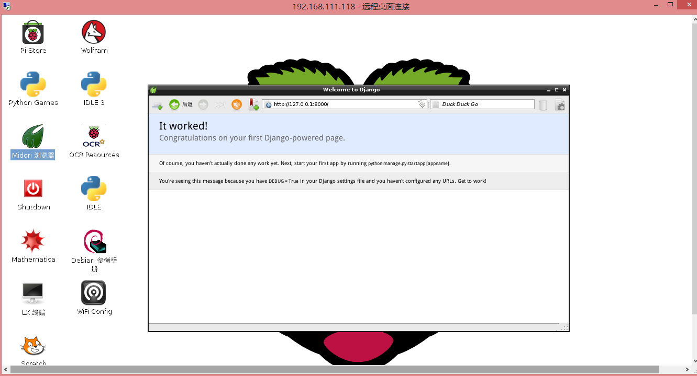
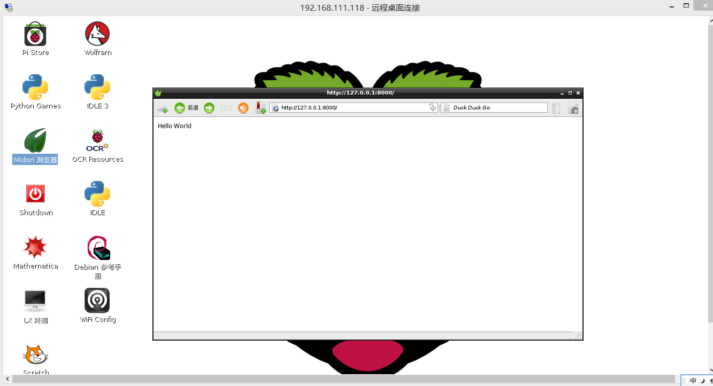

# 树莓派Django试玩
=========================================

由于博主最近在学习python，所以顺手玩了下Django

Django是Python下的一款网络服务器框架。Python下有许多款不同的框架。Django是重量级选手中最有代表性的一位。许多成功的网站和APP都基于Django。

### **安装pip**

```bash
sudo apt-get install python-pip python-dev build-essential 
sudo pip install --upgrade pip
```

### **安装Django**

```bash
sudo pip install django
```

安装成功之后我们可以进入python命令行查看django版本

```bash
pi@raspberrypi ~/python_test $ python
Python 2.7.3 (default, Mar 18 2014, 05:13:23) 
[GCC 4.6.3] on linux2
Type "help", "copyright", "credits" or "license" for more         information.
>>> import django
>>> print(django.VERSION)
(1, 6, 5, 'final', 0)
>>> 
```

### **启动**

使用下面的命令创建项目：

```bash
django-admin.py startproject django_site
```

在当前目录下，将生成django_site文件夹。其文件树结构如下:

```bash
pi@raspberrypi ~ $ tree django_site/
django_site/
├── django_site
│   ├── __init__.py
│   ├── settings.py
│   ├── urls.py
│   └── wsgi.py
└── manage.py

1 directory, 5 files
```
    

进入django_site，启动服务器：

```bash
pi@raspberrypi ~ $ cd django_site/
pi@raspberrypi ~/django_site $ python manage.py runserver 8000
Validating models...

0 errors found
May 24, 2014 - 12:46:51
Django version 1.6.5, using settings 'django_site.settings'
Starting development server at http://127.0.0.1:8000/
Quit the server with CONTROL-C.
```
    

进入树莓派桌面并打开浏览器，访问[http://127.0.0.1:8000，可以看到服务器已经在运行：](http://127.0.0.1:8000，可以看到服务器已经在运行：)



### **第一个网页’hello word’**

修改urls.py

```bash
pi@raspberrypi ~/django_site/django_site $ vim /home/pi/django_site/django_site/urls.py

from django.conf.urls import patterns, include, url

from django.contrib import admin
admin.autodiscover()

urlpatterns = patterns('',
    # Examples:
    # url(r'^$', 'mysite.views.home', name='home'),
    # url(r'^blog/', include('blog.urls')),

    url(r'^admin/', include(admin.site.urls)),
    url(r'^$', 'django_site.views.first_page'),
)
```

我们添加了最后一行。它将根目录的URL分配给一个对象进行处理，这个对象是django\_site.first\_page。

用以处理HTTP请求的这一对象还不存在，我们在django\_site/django\_site下创建views.py，并在其中定义first_page函数:

```bash
pi@raspberrypi ~/django_site/django_site $ vim views.py 
# -*- coding: utf-8 -*-

from django.http import HttpResponse

def first_page(request):
    return HttpResponse("<p>Hello World</p>")
```
    

第一行说明字符编码为utf-8，为下面使用中文做准备。first_page函数的功能，是返回http回复，即这里的**Hello World** 。first_page有一个参数request，该参数包含有请求的具体信息，比如请求的类型等，这里并没有用到。

页面效果如下：



到此就可以尽情感受在树莓派上Django的编程乐趣了！


