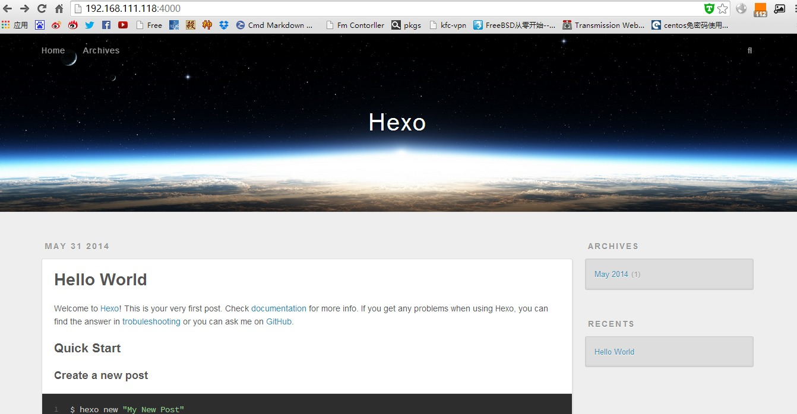
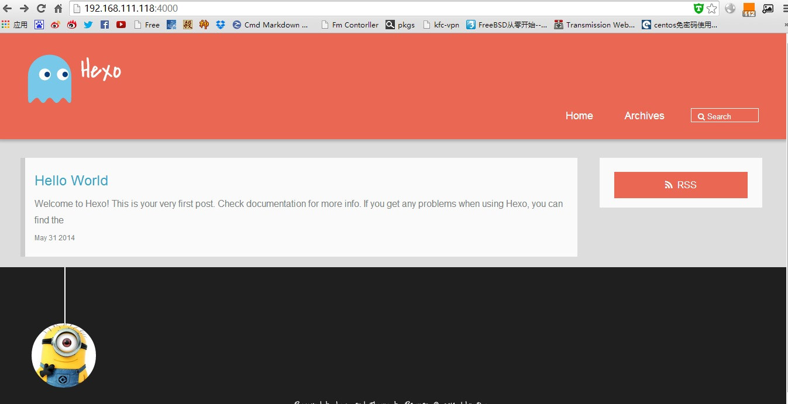

hexo是由Node.js驱动的一款快速、简单且功能强大的博客框架。可以部署在VPS或者gitpages上面

它和jekyll`Octopress相比，更快，更轻量。

安装node.js的arm环境
---------------

```bash
sudo wget http://nodejs.org/dist/v0.10.26/node-v0.10.26-linux-arm-pi.tar.gz
sudo tar zxvf node-v0.10.26-linux-arm-pi.tar.gz 
sudo mv node-v0.10.26-linux-arm-pi/ node
sudo mv node /usr/local/
sudo chown -R pi.pi /usr/local/node
```

### 设置环境变量

```bash
echo "PATH=$PATH:/usr/local/node/bin" >> /etc/profile
echo "export PATH" >> /etc/profile
source /etc/profile
node -v
```
    

安装Hexo
------

```bash
npm install -g hexo
mkdir -p /home/hexo
cd /home
hexo init hexo/  #添加一个博客站点
cd /home/hexo
npm install
hexo server  #开地本地预览
```
    

### 预览Hexo

在浏览器输入[http://192.168.111.118:4000/](http://192.168.111.118:4000/)



添加主题
----

### 安装主题

```bash
git clone https://github.com/A-limon/pacman.git themes/pacman
```
    

### 启用主题

修改你的博客根目录下的_config.yml配置文件中的theme属性，将其设置为pacman。

```bash
vim /home/hexo/_config.yml
hexo generate  #部署应用
hexo server
```
    

### 预览新主题



使用nginx发布
---------

```bash
server {
    listen 8080;
    server_name localhost;
    index index.html index.htm index.php;
    root  /home/hexo/public;
}
```
    

关于更多的教程，以及发布文章，页面等
------------------

请移步 [Hexo官方](http://hexo.io/docs/writing.html)

[更多的静态站点等着你折腾](http://www.iteye.com/magazines/133)
--------------------------------------------------

参考[hexo你的博客](http://ibruce.info/2013/11/22/hexo-your-blog/)

[pcman](http://yangjian.me/workspace/introducing-pacman-theme/)

[node.js](/tags/nodejs/)[Hexo](/tags/Hexo/)


