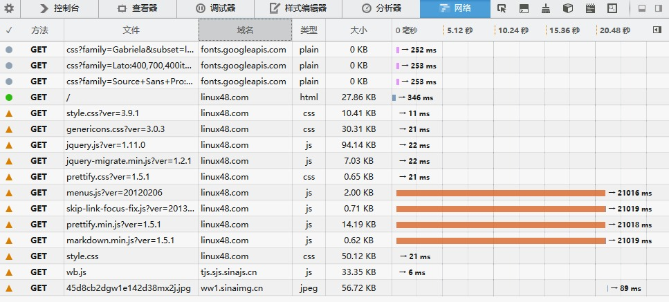

今天有个基友忽然给我说linux48打开奇慢无比，我在chrome试了一下是ok的很快，但是在其他浏览器就爆慢，后来终于发现原来我chrome走的是SOCKS5代理，这下原因很明显了。最近郭嘉对于**谷歌**又是一轮**XX**,真是忍不住要放一句**病魔加油~~**

为了证明我的猜想是正确的，方法很简单，使用**F12**开发者模式的**网络**选项就可以查看到

尼玛，果然不出我所料~ 正是wordpress引用google开放css加载不到

### 解决方案

#### 1&#46;新建google-font.css 放在\wp-includes\css目录中

    @font-face {
    font-family: ‘Open Sans’;
    font-style: normal;
    font-weight: 300;
    src: local(‘Open Sans Light’), local(‘OpenSans-Light’), url(../fonts/google/DXI1ORHCpsQm3Vp6mXoaTRa1RVmPjeKy21_GQJaLlJI.woff) format(‘woff’);
    }
    @font-face {
    font-family: ‘Open Sans’;
    font-style: normal;
    font-weight: 400;
    src: local(‘Open Sans’), local(‘OpenSans’), url(../fonts/google/u-WUoqrET9fUeobQW7jkRT8E0i7KZn-EPnyo3HZu7kw.woff) format(‘woff’);
    }
    @font-face {
    font-family: ‘Open Sans’;
    font-style: normal;
    font-weight: 600;
    src: local(‘Open Sans Semibold’), local(‘OpenSans-Semibold’), url(../fonts/google/MTP_ySUJH_bn48VBG8sNSha1RVmPjeKy21_GQJaLlJI.woff) format(‘woff’);
    }
    @font-face {
    font-family: ‘Open Sans’;
    font-style: italic;
    font-weight: 300;
    src: local(‘Open Sans Light Italic’), local(‘OpenSansLight-Italic’), url(../fonts/google/PRmiXeptR36kaC0GEAetxrsuoFAk0leveMLeqYtnfAY.woff) format(‘woff’);
    }
    @font-face {
    font-family: ‘Open Sans’;
    font-style: italic;
    font-weight: 400;
    src: local(‘Open Sans Italic’), local(‘OpenSans-Italic’), url(../fonts/google/xjAJXh38I15wypJXxuGMBtIh4imgI8P11RFo6YPCPC0.woff) format(‘woff’);
    }
    @font-face {
    font-family: ‘Open Sans’;
    font-style: italic;
    font-weight: 600;
    src: local(‘Open Sans Semibold Italic’), local(‘OpenSans-SemiboldItalic’), url(../fonts/google/PRmiXeptR36kaC0GEAetxmWeb5PoA5ztb49yLyUzH1A.woff) format(‘woff’);
    }
    

#### 2&#46;修改 \wp-includes\script-loader.php 文件，找到：

    $open_sans_font_url = “//fonts.googleapis.com/css?family=Open+Sans:300italic,400italic,600italic,300,400,600&subset=$subsets”;
    

替换成：

    $open_sans_font_url = “/wp-includes/css/google-font.css”;
    

#### 3&#46;在WordPress模板文件中找到functions.php，使用“//”注释掉引用google字体库部分即可

